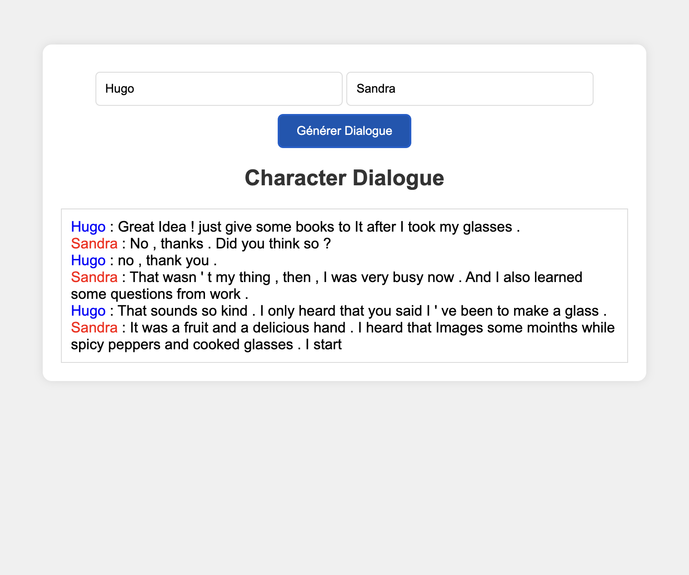

# Text Generation Web App with Transformer Model

| | |
|:--|:--|
| **Explore the power of a transformer model, pretrained and fine-tuned on diverse datasets, for generating text. This web application offers an interactive way to experience text generation.** |  |

This application leverages a transformer model initially pretrained on the `openweb.text` dataset and subsequently fine-tuned on the `DailyDialog` dataset. The model excels in generating conversational text, allowing users to enter names of two characters and observe generated dialogues.

## Model Training Details

The model underwent two distinct training phases:

- **Pretraining**:
  - **Dataset**: `openweb.text`
  - **Learning Rate**: 1e-3 with a scheduler
  - **Dropout**: None used during pretraining

- **Fine-tuning**:
  - **Dataset**: `DailyDialog`
  - **Learning Rate**: 1e-4 with a scheduler
  - **Dropout**: 0.1

## Model Parameters 

The transformer model is customized to capture the nuances of dialogic text:

| Parameter | Value |
|:--|:--|
| **Number of Transformer Blocks** | 6 |
| **Number of Attention Heads** | 6 |
| **Embedding Size** | 384 |
| **Attention Dropout** | 0.1 during fine-tuning |
| **Context Size** | 512 |

The context length was optimized for capturing the dynamics of conversation.

## Features

- **Character Name Inputs**: Enter the names of two characters to generate a conversation between them.
- **Dynamic Text Generation**: Real-time text generation simulating dialogue.
- **Interactive Interface**: User-friendly interface for easy interaction with the model.

## How to Use 

- **Access**: This web-based application is accessible via modern browsers like Google Chrome or Mozilla Firefox.
- **Interactive Dialogue**: Input the names of two characters and observe the generated dialogue.
- **Experimentation**: Try different inputs to explore the model's text generation capabilities.

## Try It Out

You can try the app by visiting [Web App Link](https://hugodmn.github.io/conditionned_theatre_play_generation/).
